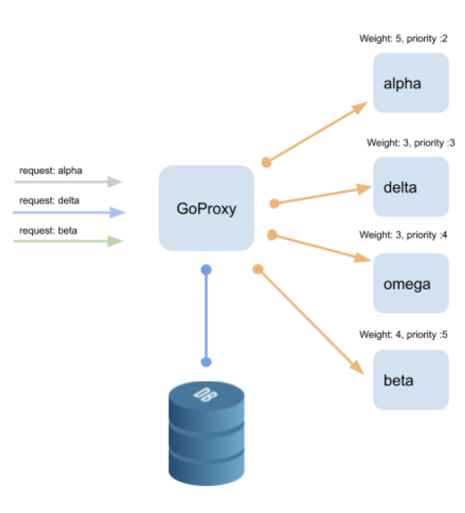

# Load Balancer Proxy in Go
### LBPG

This example is part of the internal series for the Golang workshop.

The application is a proxy that will redirect and prioritize requests based on the domain and the  weight / priority  associated, stored in a sql database. We will use Iris as framework to work with http routing.

> special thanks to  https://github.com/narenaryan because with his help I can build the concurrent requestor by taking his example from https://blog.narenarya.in/concurrent-http-in-go.html